# 🧩 Serverless Three-Tier User Directory App on AWS

## 📌 Overview

This project is a **serverless web application** built on AWS. It allows users to search for specific users by their ID and fetch user information from a DynamoDB table. The application architecture follows the three-tier model:

- **Presentation Layer**: Static frontend hosted on **Amazon S3**, delivered via **CloudFront**
- **Application Layer**: **AWS Lambda** function triggered by **API Gateway**
- **Data Layer**: **Amazon DynamoDB** for user data storage

---

## 🧱 Architecture

### 1. Presentation Tier (Frontend)
- Files: `index.html`, `style.css`, `script.js`
- Hosting: Amazon S3 (static website hosting)
- Distribution: CloudFront (CDN with HTTPS support)

### 2. Application Tier (Logic)
- AWS Lambda function (Node.js/Python)
- Triggered by API Gateway HTTP endpoint
- Fetches data from DynamoDB and returns a JSON response

### 3. Data Tier (Database)
- DynamoDB table with `userId` as the partition key
- Stores user details (e.g., name, email)

---

## 🔄 App Flow

1. User inputs a `userId` on the frontend.
2. JavaScript (`script.js`) sends a `GET` request to the API Gateway endpoint.
3. Lambda function queries DynamoDB for the matching `userId`.
4. The result is returned and displayed dynamically on the page.

---

## ⚙️ Technologies Used

| Layer         | Technology                       |
|---------------|----------------------------------|
| Frontend      | HTML, CSS, JavaScript, S3, CloudFront |
| Backend       | AWS Lambda, API Gateway          |
| Data Storage  | Amazon DynamoDB                  |

---

## ✅ Features

- 🔎 Search users by ID
- 🚫 No backend server to manage (fully serverless)
- 🌍 Global delivery with CloudFront
- 💡 Lightweight and cost-effective

---

## 🖼️ Screenshots

### 🔹 Web Application - Homepage
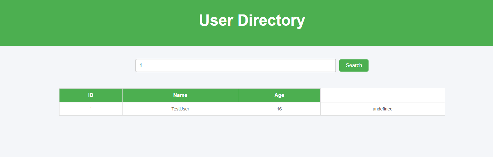

---

### 🔹 Web Application - Search Result
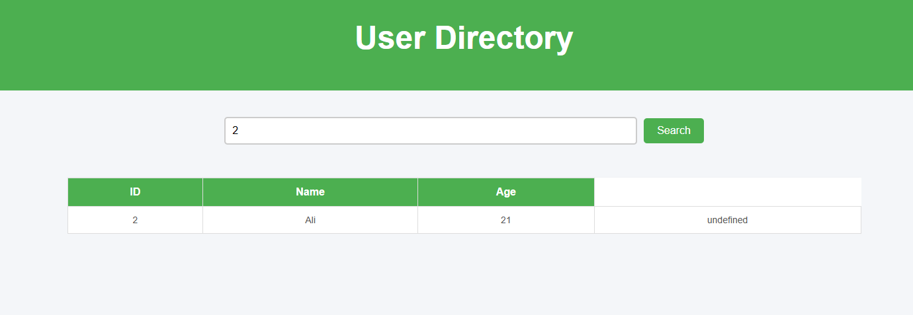

---

### 🔹 S3 Bucket Objects
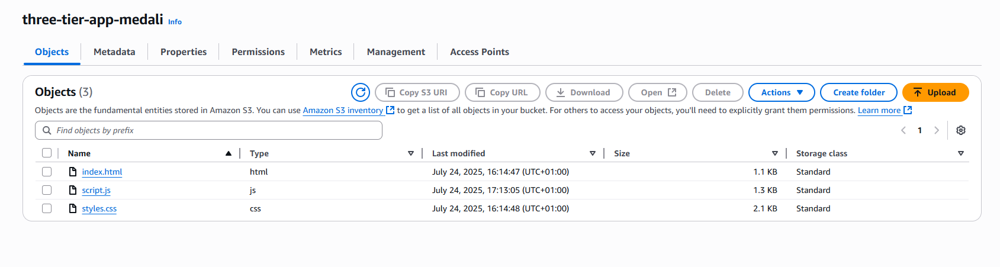

---

### 🔹 CloudFront Distribution
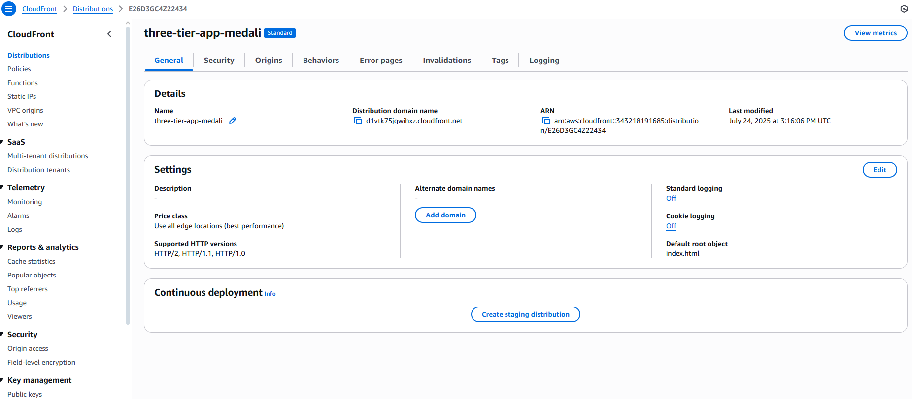

---

### 🔹 DynamoDB Console
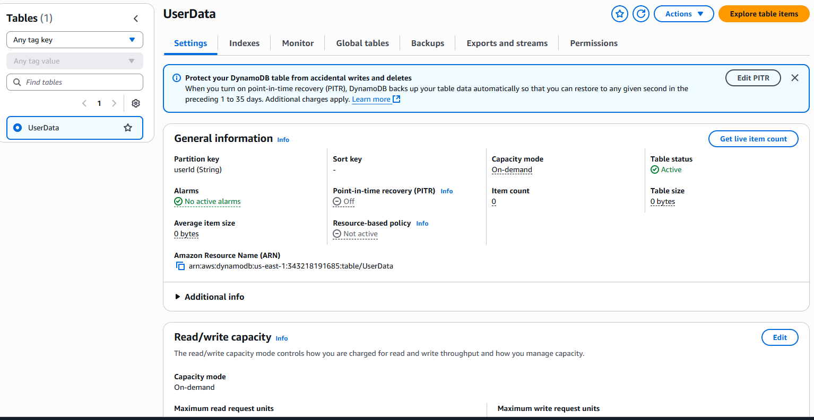

---

### 🔹 DynamoDB Table View
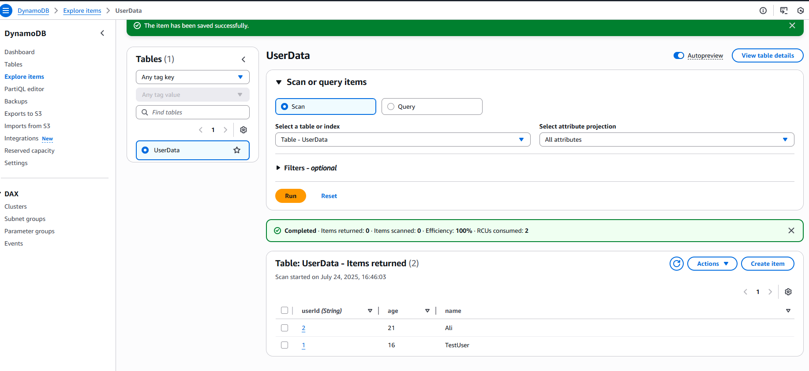

---

### 🔹 Lambda Console
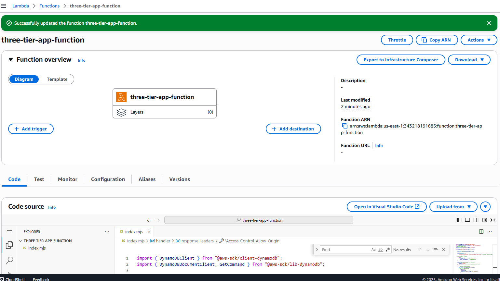

---

### 🔹 Lambda Function Code
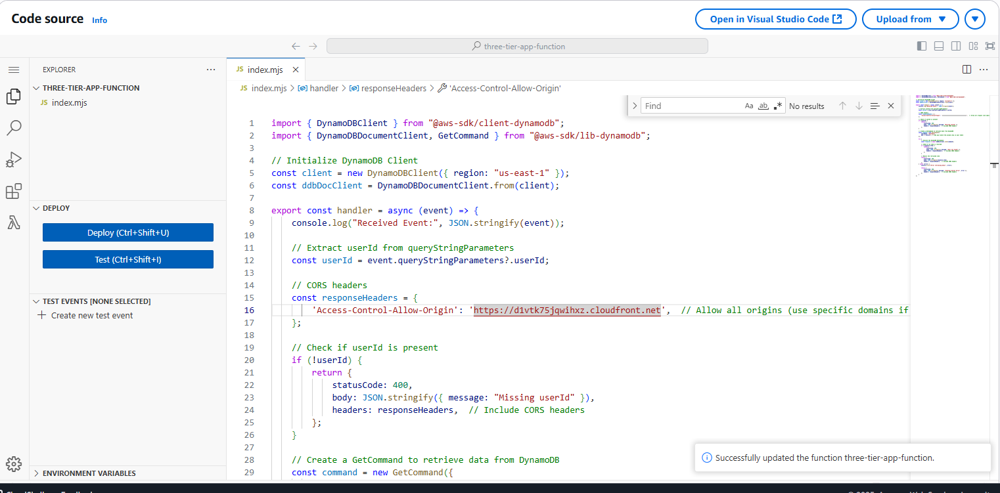

---

### 🔹 Lambda IAM Roles
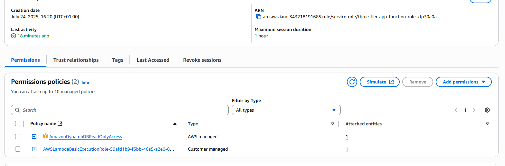

---

### 🔹 API Gateway - GET Method
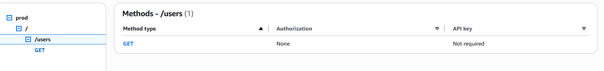

---

### 🔹 API Gateway - Lambda Integration
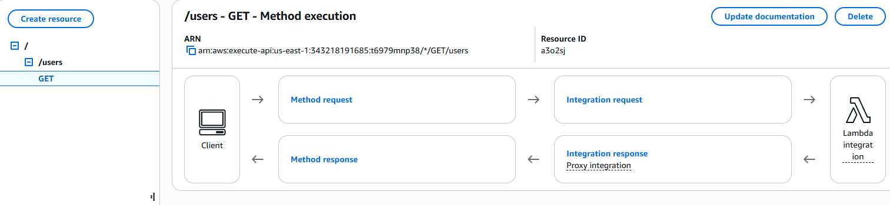

---

### 🔹 API Gateway - Prod Stage
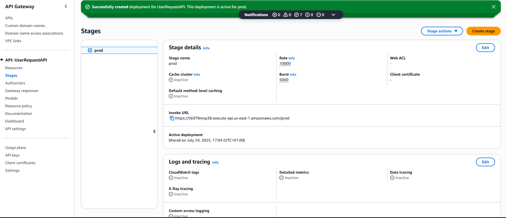


## 📁 Project Structure

```plaintext
.
├── index.html        # Main UI
├── style.css         # Frontend styling
├── script.js         # API calls and DOM logic
├── lambda.txt         # Lambda code to fetch data from DynamoDB
└── README.md         # Project documentation
└── Screenshots/
    ├── APIGatewayGetMethod.png
    ├── APIGatewayLambdaIntegration.png
    ├── APIGatewayProd.png
    ├── CloudFrontDistribution.png
    ├── DynamoDB.png
    ├── DynamoDbTable.png
    ├── Lambda.png
    ├── LambdaCode.png
    ├── LambdaRoles.png
    ├── S3BucketObjects.png
    ├── WorkingWebApp.png
    └── WorkingWebApp2.png


